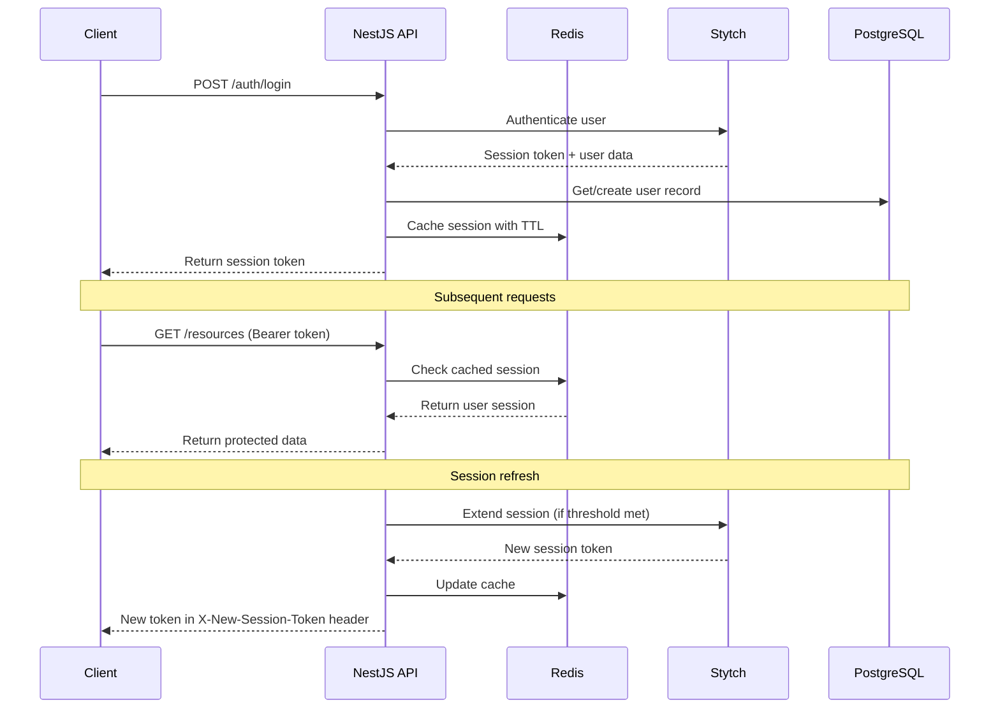
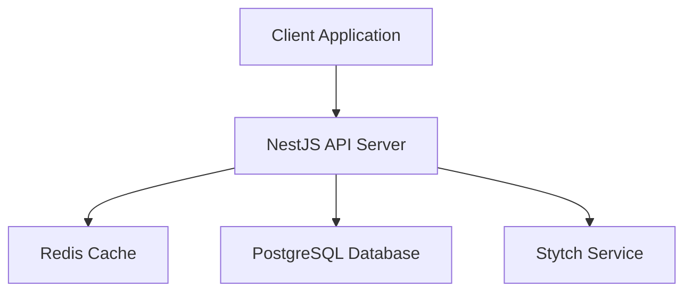

# Stytch NestJS Starter

<p align="center">
  <a href="https://u11d.com/" target="blank"></a>
</p>

<p align="center">
<svg fill="none" width="128" viewBox="0 0 280 89" xmlns="http://www.w3.org/2000/svg"><path d="M16.0023 19.1967C16.0023 24.6088 18.2913 27.0809 24.7411 28.617L24.7309 28.6272L33.1746 30.672C45.596 33.724 51.1404 39.8278 51.1404 50.4486C51.1404 64.6605 41.4657 72.8092 25.7787 72.8092C10.0918 72.8092 1.18008 65.6168 0 51.9847H13.5811C14.4459 58.8313 18.7288 62.3003 25.7787 62.3003C32.8287 62.3003 37.3863 58.4854 37.3863 52.585C37.3863 47.0203 34.5683 44.2226 27.3556 42.6051L18.8305 40.6519C11.2617 38.841 2.24826 33.9376 2.24826 20.7837C2.24826 8.35215 11.7805 0 25.9619 0C41.2216 0 49.1261 6.06319 50.1027 18.5151H35.962C35.2906 13.0114 31.9538 10.3257 25.7787 10.3257C20.0207 10.3257 16.0023 13.7846 16.0023 19.1967Z" fill="#FBFAF9"></path><path d="M214.479 36.8772C213.472 31.7194 210.135 29.3185 204.031 29.3185H203.146C195.13 29.3185 189.941 35.6462 189.941 45.4226C189.941 55.199 195.12 61.5267 203.146 61.5267H204.031C210.135 61.5267 213.462 59.1258 214.479 53.968H227.826C226.595 66.1148 218.009 72.7884 203.594 72.7884C188.324 72.7884 177.663 61.5369 177.663 45.4226C177.663 29.3083 188.324 18.0569 203.594 18.0569C218.009 18.0569 226.595 24.7406 227.826 36.8772H214.479Z" fill="#FBFAF9"></path><path d="M161.62 54.9044V28.9833H175.761V17.9963H166.574C163.838 17.9963 161.61 15.7887 161.61 13.0827V0H148.151V18.0065H136.95C132.23 18.0065 127.977 20.8346 126.126 25.2192L114.488 52.7986L102.077 24.9954C100.184 20.743 95.9727 17.9963 91.3541 17.9963H75.2399C72.5033 17.9963 70.2754 15.7887 70.2754 13.0827V0H56.8163V58.8109C56.8163 67.9566 61.6486 72.799 70.784 72.799H83.5717V61.5475H76.9083C71.6386 61.5475 70.2754 60.1843 70.2754 54.9044V28.9833H86.6847C88.2005 28.9833 89.3195 29.6038 89.8485 30.7127L107.957 68.8823V71.6877C107.957 77.0693 106.471 77.3033 101.324 77.3033H84.416V88.7582H106.777C115.393 88.7582 120.744 82.6238 120.744 72.7559L120.795 68.2313L138.161 30.7432C138.69 29.6038 139.819 28.9833 141.345 28.9833H148.141V58.8008C148.141 67.9464 152.973 72.7888 162.108 72.7888H175.283V61.5373H168.233C162.963 61.5373 161.6 60.1741 161.6 54.8943L161.62 54.9044Z" fill="#FBFAF9"></path><path d="M246.805 25.2396L247.71 24.1307H247.7C250.844 20.2954 254.038 18.0675 261.129 18.0675C273.113 18.0675 280 25.5956 280 38.7393V72.799H266.541V40.4179C266.541 36.3486 265.381 33.1136 263.184 31.0484C261.414 29.38 259.033 28.5967 256.307 28.7595C249.826 29.1664 246.805 34.2021 246.805 44.6296V72.799H233.346V0H246.805V25.2396Z" fill="#FBFAF9"></path></svg>
</p>

<p align="center">
  <a href="http://nestjs.com/" target="blank"></a>
</p>

<p align="center">A production-ready NestJS backend starter with <a href="https://stytch.com" target="_blank">Stytch</a> authentication integration</p>

## 🚀 Overview

This starter template provides a robust, production-ready NestJS backend with Stytch authentication integration. Instead of building authentication from scratch (which is complex and risky), this template leverages Stytch's secure, battle-tested authentication platform.

## ✨ Features

- 🔐 **Complete Stytch Integration**: Email/password authentication with session management
- 🏗️ **NestJS Best Practices**: Modular architecture, guards, interceptors, and decorators
- 💾 **Redis Session Caching**: Optimized session verification without hitting Stytch on every request
- 🔄 **Smart Session Refresh**: Automatic session extension based on configurable thresholds
- 👑 **Admin User Creation**: Master key protected endpoints for creating users
- 🐳 **Docker Ready**: Complete Docker setup with PostgreSQL and Redis
- 🔒 **TypeScript**: Full type safety throughout the application
- 🧪 **Testing Ready**: Jest configuration included
- 📊 **Database Migrations**: TypeORM with migration support

## 🏗️ Architecture

### Authentication Flow



### System Architecture



## 🚀 Quick Start

### Prerequisites

- Node.js 22+ and Yarn
- Docker and Docker Compose
- Stytch account ([sign up here](https://stytch.com))

### 1. Clone and Install

```bash
git clone https://github.com/u11d-com/stytch-nestjs-react-starter.git
cd stytch-nestjs-react-starter
yarn install
```

### 2. Environment Setup

```bash
cp .env.example .env
```

Configure your `.env` file which will be used for local development.

### 3. Start Infrastructure

```bash
# Start PostgreSQL and Redis
docker compose up postgres redis -d

# Run database migrations
yarn migration:run
```

### 4. Start Development Server

```bash
yarn start:dev
```

Your API will be available at http://localhost:3000

## 📋 Available Scripts

| Script                     | Description                              |
| -------------------------- | ---------------------------------------- |
| `yarn start:dev`           | Start development server with hot reload |
| `yarn build`               | Build the application                    |
| `yarn start:prod`          | Start production server                  |
| `yarn migration:generate`  | Generate new database migration          |
| `yarn migration:run`       | Run pending migrations                   |
| `yarn create-user <email>` | Create admin user (sends magic link)     |
| `yarn test`                | Run unit tests                           |
| `yarn test:e2e`            | Run end-to-end tests                     |
| `yarn lint`                | Lint and fix code                        |

## 🔐 Authentication Endpoints

### Public Endpoints

| Method | Endpoint         | Description                         |
| ------ | ---------------- | ----------------------------------- |
| `POST` | `/auth/sign-up`  | Create new user account             |
| `POST` | `/auth/login`    | Authenticate user                   |
| `POST` | `/auth/password` | Set password using magic link token |

### Protected Endpoints

| Method | Endpoint        | Description                | Auth   |
| ------ | --------------- | -------------------------- | ------ |
| `POST` | `/auth/refresh` | Refresh session token      | Bearer |
| `POST` | `/auth/logout`  | Revoke session             | Bearer |
| `GET`  | `/resources`    | Access protected resources | Bearer |

### Admin Endpoints

| Method | Endpoint       | Description                     | Auth       |
| ------ | -------------- | ------------------------------- | ---------- |
| `POST` | `/auth/invite` | Create user and send magic link | Master Key |

## 🔑 Authentication Methods

### 1. Self Sign-up

Users can create their own accounts:

```bash
curl -X POST http://localhost:3000/auth/sign-up \
  -H "Content-Type: application/json" \
  -d '{
    "email": "user@example.com",
    "password": "SecurePassword123!",
    "firstName": "John",
    "lastName": "Doe"
  }'
```

### 2. Admin User Creation

Admins can invite users (sends magic link email) using master key:

```bash
# One can use predefined script
yarn create-user admin@company.com

# ...or execute the endpoint manually
curl -X POST http://localhost:3000/auth/invite \
  -H "Content-Type: application/json" \
  -H "X-Api-Key: your-master-key" \
  -d '{
    "email": "newuser@company.com",
    "firstName": "Jane",
    "lastName": "Smith"
  }'
```

## 🔄 Session Management

### Caching Strategy

- Sessions are cached in Redis for fast verification
- Cache TTL matches Stytch session duration
- No Stytch API calls on every request = better performance

### Smart Refresh

The system automatically refreshes sessions when they're close to expiring:

- Set `STYTCH_SESSION_REFRESH_THRESHOLD_MINUTES` (default: 30)
- If session expires within threshold, it's automatically extended
- New token returned in `X-New-Session-Token` header
- Frontend should watch for this header and update stored token

### Making Authenticated Requests

```bash
curl -X GET http://localhost:3000/resources \
  -H "Authorization: Bearer your-session-token"
```

## 🐳 Docker Deployment

```bash
# Copy and configure Docker environment
cp .env.example .env.docker

# Start all services
docker compose up -d

# Check logs
docker compose logs -f server
```

## ⚙️ Configuration

### Session Duration

Control how long sessions last:

```env
STYTCH_SESSION_DURATION_MINUTES=60  # Sessions expire after 1 hour
```

### Session Refresh Threshold

Control when sessions are automatically refreshed:

```env
STYTCH_SESSION_REFRESH_THRESHOLD_MINUTES=30  # Refresh when <30min left
```

### Cache Provider

To use a different cache provider, update the `CacheModule` configuration in `app.module.ts`:

```typescript
CacheModule.register({
  // Your cache configuration
});
```

## 🔧 Customization

### Adding User Roles

1. Add role column to User entity
2. Include role in cached session
3. Create role-based guards
4. Apply role guards to controllers

### Adding 2FA

1. Enable 2FA in Stytch dashboard
2. Update authentication flow
3. Add 2FA verification endpoints

## 🚀 Extensions & Roadmap

Potential extensions (let us know if you're interested!):

- 🔐 **Role-based Access Control (RBAC)**
- 📱 **SMS/Phone Authentication**
- 🔐 **Multi-Factor Authentication (MFA)**
- 🌐 **Social Login (Google, GitHub, etc.)**
- 📧 **Email Templates & Customization**
- 📊 **Analytics & Monitoring Integration**
- 🔄 **Webhook Support**

## 🐛 Troubleshooting

1. **Stytch Configuration Errors**
   - Verify `STYTCH_PROJECT_ID` and `STYTCH_SECRET` are correct
   - Check Stytch dashboard for API key status

2. **Database Connection Issues**
   - Ensure PostgreSQL is running: `docker compose up postgres -d`
   - Run migrations: `yarn migration:run`

3. **Redis Connection Issues**
   - Ensure Redis is running: `docker compose up redis -d`
   - Check `REDIS_URL` configuration

4. **Session Issues**
   - Check session hasn't expired
   - Verify token format: `Bearer <token>`
   - Check Redis for cached session

## 🤝 Contributing

1. Fork the repository
2. Create a feature branch: `git checkout -b feature/my-feature`
3. Make your changes and add tests
4. Commit your changes: `git commit -am 'Add some feature'`
5. Push to the branch: `git push origin feature/my-feature`
6. Submit a pull request

## 📄 License

This project is licensed under the MIT License - see the [LICENSE](LICENSE) file for details.

## 🙏 Acknowledgments

- [Stytch](https://stytch.com) for providing secure authentication infrastructure
- [NestJS](https://nestjs.com) for the amazing framework
- The open-source community for inspiration and tools

---

<p align="center">
  Made with ❤️ by <a href="https://u11d.com">u11d</a>
</p>
