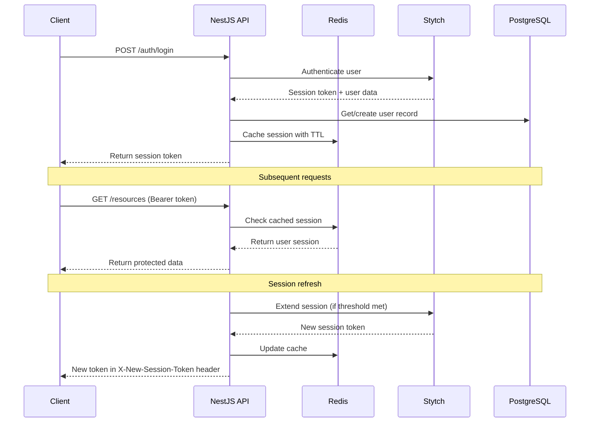
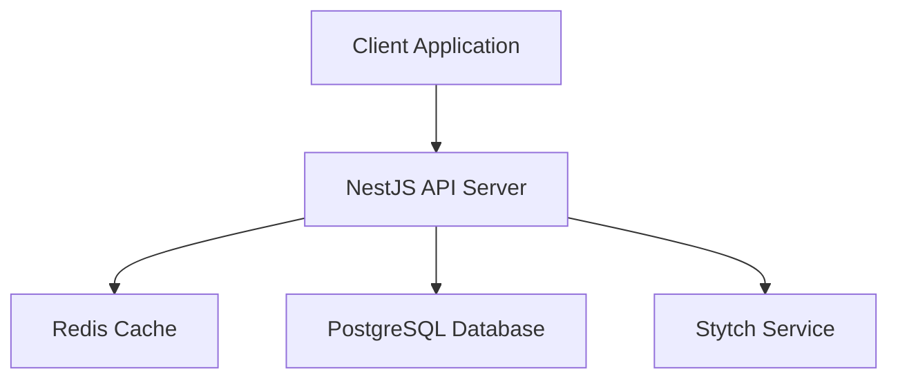

# Stytch NestJS Starter

<p align="center">
  <a href="https://u11d.com/" target="blank"></a>
</p>

<p align="center">
  <a href="https://u11d.com/" target="blank"></a>
  <a href="http://nestjs.com/" target="blank"></a>
</p>

<p align="center">A production-ready NestJS backend starter with <a href="https://stytch.com" target="_blank">Stytch</a> authentication integration</p>

## 🚀 Overview

This starter template provides a robust, production-ready NestJS backend with Stytch authentication integration. Instead of building authentication from scratch (which is complex and risky), this template leverages Stytch's secure, battle-tested authentication platform.

## ✨ Features

- 🔐 **Complete Stytch Integration**: Email/password authentication with session management
- 🏗️ **NestJS Best Practices**: Modular architecture, guards, interceptors, and decorators
- 💾 **Redis Session Caching**: Optimized session verification without hitting Stytch on every request
- 🔄 **Smart Session Refresh**: Automatic session extension based on configurable thresholds
- 👑 **Admin User Creation**: Master key protected endpoints for creating users
- 🐳 **Docker Ready**: Complete Docker setup with PostgreSQL and Redis
- 🔒 **TypeScript**: Full type safety throughout the application
- 🧪 **Testing Ready**: Jest configuration included
- 📊 **Database Migrations**: TypeORM with migration support

## 🏗️ Architecture

### Authentication Flow



### System Architecture



## 🚀 Quick Start

### Prerequisites

- Node.js 22+ and Yarn
- Docker and Docker Compose
- Stytch account ([sign up here](https://stytch.com))

### 1. Clone and Install

```bash
git clone https://github.com/u11d-com/stytch-nestjs-react-starter.git
cd stytch-nestjs-react-starter
yarn install
```

### 2. Environment Setup

```bash
cp .env.example .env
```

Configure your `.env` file which will be used for local development.

### 3. Start Infrastructure

```bash
# Start PostgreSQL and Redis
docker compose up postgres redis -d

# Run database migrations
yarn migration:run
```

### 4. Start Development Server

```bash
yarn start:dev
```

Your API will be available at http://localhost:3000

## 📋 Available Scripts

| Script                     | Description                              |
| -------------------------- | ---------------------------------------- |
| `yarn start:dev`           | Start development server with hot reload |
| `yarn build`               | Build the application                    |
| `yarn start:prod`          | Start production server                  |
| `yarn migration:generate`  | Generate new database migration          |
| `yarn migration:run`       | Run pending migrations                   |
| `yarn create-user <email>` | Create admin user (sends magic link)     |
| `yarn test`                | Run unit tests                           |
| `yarn test:e2e`            | Run end-to-end tests                     |
| `yarn lint`                | Lint and fix code                        |

## 🔐 Authentication Endpoints

### Public Endpoints

| Method | Endpoint         | Description                         |
| ------ | ---------------- | ----------------------------------- |
| `POST` | `/auth/sign-up`  | Create new user account             |
| `POST` | `/auth/login`    | Authenticate user                   |
| `POST` | `/auth/password` | Set password using magic link token |

### Protected Endpoints

| Method | Endpoint        | Description                | Auth   |
| ------ | --------------- | -------------------------- | ------ |
| `POST` | `/auth/refresh` | Refresh session token      | Bearer |
| `POST` | `/auth/logout`  | Revoke session             | Bearer |
| `GET`  | `/resources`    | Access protected resources | Bearer |

### Admin Endpoints

| Method | Endpoint       | Description                     | Auth       |
| ------ | -------------- | ------------------------------- | ---------- |
| `POST` | `/auth/invite` | Create user and send magic link | Master Key |

## 🔑 Authentication Methods

### 1. Self Sign-up

Users can create their own accounts:

```bash
curl -X POST http://localhost:3000/auth/sign-up \
  -H "Content-Type: application/json" \
  -d '{
    "email": "user@example.com",
    "password": "SecurePassword123!",
    "firstName": "John",
    "lastName": "Doe"
  }'
```

### 2. Admin User Creation

Admins can invite users (sends magic link email) using master key:

```bash
# One can use predefined script
yarn create-user admin@company.com

# ...or execute the endpoint manually
curl -X POST http://localhost:3000/auth/invite \
  -H "Content-Type: application/json" \
  -H "X-Api-Key: your-master-key" \
  -d '{
    "email": "newuser@company.com",
    "firstName": "Jane",
    "lastName": "Smith"
  }'
```

## 🔄 Session Management

### Caching Strategy

- Sessions are cached in Redis for fast verification
- Cache TTL matches Stytch session duration
- No Stytch API calls on every request = better performance

### Smart Refresh

The system automatically refreshes sessions when they're close to expiring:

- Set `STYTCH_SESSION_REFRESH_THRESHOLD_MINUTES` (default: 30)
- If session expires within threshold, it's automatically extended
- New token returned in `X-New-Session-Token` header
- Frontend should watch for this header and update stored token

### Making Authenticated Requests

```bash
curl -X GET http://localhost:3000/resources \
  -H "Authorization: Bearer your-session-token"
```

## 🐳 Docker Deployment

```bash
# Copy and configure Docker environment
cp .env.example .env.docker

# Start all services
docker compose up -d

# Check logs
docker compose logs -f server
```

## ⚙️ Configuration

### Session Duration

Control how long sessions last:

```env
STYTCH_SESSION_DURATION_MINUTES=60  # Sessions expire after 1 hour
```

### Session Refresh Threshold

Control when sessions are automatically refreshed:

```env
STYTCH_SESSION_REFRESH_THRESHOLD_MINUTES=30  # Refresh when <30min left
```

### Cache Provider

To use a different cache provider, update the `CacheModule` configuration in `app.module.ts`:

```typescript
CacheModule.register({
  // Your cache configuration
});
```

## 🔧 Customization

### Adding User Roles

1. Add role column to User entity
2. Include role in cached session
3. Create role-based guards
4. Apply role guards to controllers

### Adding 2FA

1. Enable 2FA in Stytch dashboard
2. Update authentication flow
3. Add 2FA verification endpoints

## 🚀 Extensions & Roadmap

Potential extensions (let us know if you're interested!):

- 🔐 **Role-based Access Control (RBAC)**
- 📱 **SMS/Phone Authentication**
- 🔐 **Multi-Factor Authentication (MFA)**
- 🌐 **Social Login (Google, GitHub, etc.)**
- 📧 **Email Templates & Customization**
- 📊 **Analytics & Monitoring Integration**
- 🔄 **Webhook Support**

## 🐛 Troubleshooting

1. **Stytch Configuration Errors**
   - Verify `STYTCH_PROJECT_ID` and `STYTCH_SECRET` are correct
   - Check Stytch dashboard for API key status

2. **Database Connection Issues**
   - Ensure PostgreSQL is running: `docker compose up postgres -d`
   - Run migrations: `yarn migration:run`

3. **Redis Connection Issues**
   - Ensure Redis is running: `docker compose up redis -d`
   - Check `REDIS_URL` configuration

4. **Session Issues**
   - Check session hasn't expired
   - Verify token format: `Bearer <token>`
   - Check Redis for cached session

## 🤝 Contributing

1. Fork the repository
2. Create a feature branch: `git checkout -b feature/my-feature`
3. Make your changes and add tests
4. Commit your changes: `git commit -am 'Add some feature'`
5. Push to the branch: `git push origin feature/my-feature`
6. Submit a pull request

## 📄 License

This project is licensed under the MIT License - see the [LICENSE](LICENSE) file for details.

## 🙏 Acknowledgments

- [Stytch](https://stytch.com) for providing secure authentication infrastructure
- [NestJS](https://nestjs.com) for the amazing framework
- The open-source community for inspiration and tools

---

<p align="center">
  Made with ❤️ by <a href="https://u11d.com">u11d</a>
</p>
